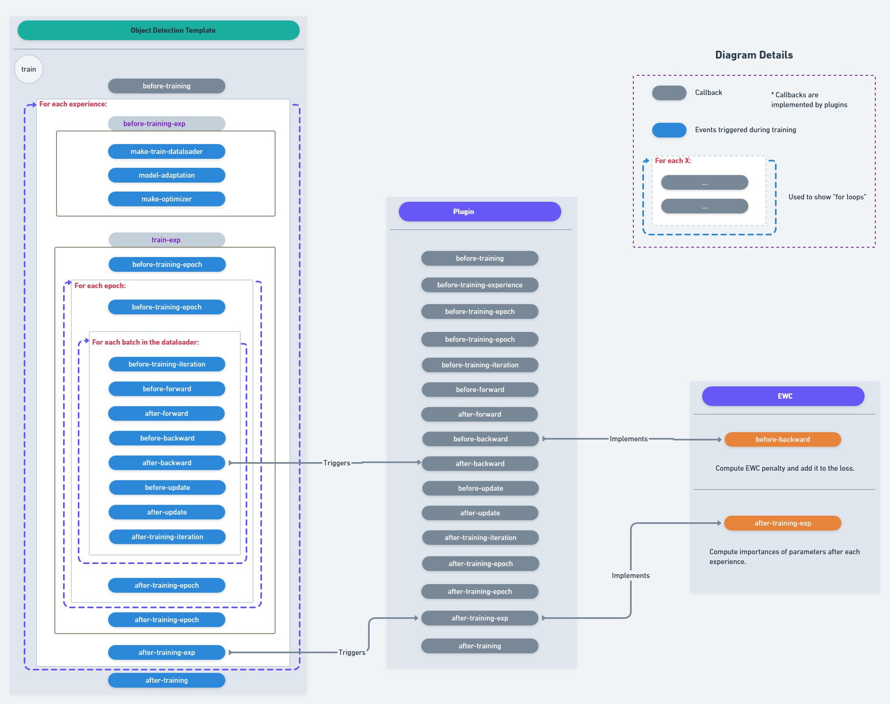

# 3rd CLVision Workshop @ CVPR 2022 Challenge

This is the official starting repository for the **Continual Learning Challenge** held in the **3rd CLVision Workshop @ CVPR 2022**.

Please refer to the [**challenge website**](https://sites.google.com/view/clvision2022/challenge) for more details!

The Slack channel #3rd_clvision_challenge is now open in the ContinualAI Slack: [join here](https://continualai.slack.com/join/shared_invite/enQtNjQxNDYwMzkxNzk0LTBhYjg2MjM0YTM2OWRkNDYzOGE0ZTIzNDQ0ZGMzNDE3ZGUxNTZmNmM1YzJiYzgwMTkyZDQxYTlkMTI3NzZkNjU#/shared-invite/email).

**We are gathering feedback about the devkit.** Join the Slack channel or open an issue directly on this repo!

**Updates:**
- 07/04/2022
  - Support for the creation of a **validation stream**. The number of videos per class (instance or category, 
  depending on the track) to move from the "train" to the "valid" stream can be configured as a parameter of the
  benchmark creation procedure.
  - Annotation 127172 (area==0) is now automatically ignored.
- 13/04/2022
  - Solved an issue with output generation for detection tracks.
  - Fixed the name of metrics of detection tracks.

## Getting started

This repo may be updated during the challenge to fix bugs and integrate suggestions from the community, so make sure
to *check it out from time to time*.

The devkit is based on the [Avalanche library](https://github.com/ContinualAI/avalanche). We warmly recommend looking at the [documentation](https://avalanche.continualai.org/) (especially the ["Zero To Hero tutorials"](https://avalanche.continualai.org/from-zero-to-hero-tutorial/01_introduction)) if this is your first time using it!
Avalanche is added as a Git submodule of this repository. 

The recommended setup steps are as follows:

1. **Install [conda](https://docs.conda.io/projects/conda/en/latest/user-guide/install/download.html)** (and [mamba](https://github.com/mamba-org/mamba); recommended)

2. **Clone the repo** and **create the conda environment**:
```bash
git clone --recurse-submodules https://github.com/ContinualAI/clvision-challenge-2022.git
cd clvision-challenge-2022
conda env create -f environment.yml
```

3. **Setup your IDE** so that the avalanche submodule is included in the *PYTHONPATH*. Note: you have to include the top-level folder, not `avalanche/avalanche`!
   1. For Jetbrains IDEs (PyCharm), this can be done from the *Project* pane (usually on the right) by right-clicking on the "avalanche" folder -> "Mark Directory as" -> "Sources Root".
   2. For VS Code, follow the [official documentation](https://code.visualstudio.com/docs/python/environments#_use-of-the-pythonpath-variable).

4. **Download and extract the dataset**: in order to download the dataset, we ask all participants to accept the dataset terms and provide their email addresses through [this form](https://forms.gle/kwB3CRKAxkiJWVQ57). 
You will immediately receive the download instructions at the provided address. We recommend extracting the dataset in the default folder `$HOME/3rd_clvision_challenge/demo_dataset/`.
The final directory structure should be like this:

```
$HOME/3rd_clvision_challenge/challenge/
├── ego_objects_challenge_test.json
├── ego_objects_challenge_train.json
├── images
│   ├── 07A28C4666133270E9D65BAB3BCBB094_0.png
│   ├── 07A28C4666133270E9D65BAB3BCBB094_100.png
│   ├── 07A28C4666133270E9D65BAB3BCBB094_101.png
│   ├── ...
```

The aforementioned steps should be OS-agnostic. However, we recommend setting up your dev environment using a 
mainstream Linux distribution.

## Object Classification (Track 1) Training Template
The starting template for the object classification track is based on the tried and tested strategies from Avalanche.

In particular, the starting template can be found in 
[`starting_template_instance_classification.py`](starting_template_instance_classification.py). The 
default template implements a working train/eval loop that uses the
[Naive](https://avalanche-api.continualai.org/en/latest/generated/avalanche.training.Naive.html) strategy.

The Naive strategy is a plain fine-tuning loop that, given the optimizer, number of epochs, the minibatch size, and 
the loss function, will just run a very forgetting-prone training loop. This should be taken as the lower bound for a 
solution. This means that the basic loop is already there, ready to be customized. There are two main ways to implement 
your solution:
- Override parts of the base class `SupervisedTemplate` in order to customize the epoch loop, 
the backward and forward operations, etcetera.
- Implement your solution as a plugin (many mainstream techniques are implemented in Avalanche as plugins, 
see [the documentation](https://avalanche-api.continualai.org/en/latest/training.html#training-plugins)).

We suggest you to study the [From Zero To Hero tutorials](https://avalanche.continualai.org/from-zero-to-hero-tutorial/01_introduction) to learn about Avalanche.

## Object Detection (Track 2 and 3) Training Templates
The starting point for the detection tracks are
[`starting_template_category_detection.py`](starting_template_category_detection.py) and
[`starting_template_instance_detection.py`](starting_template_instance_detection.py).
That entry point uses the 
([ObjectDetectionTemplate](https://github.com/ContinualAI/avalanche/blob/master/avalanche/training/supervised/naive_object_detection.py))
template, which is the template you should customize to implement your CL strategy. The recommended way to do this is to create
a child class.

That training template is based on Avalanche [training templates](https://avalanche.continualai.org/from-zero-to-hero-tutorial/04_training). 
The training loop is an almost exact implementation of the one shown in the official
[TorchVision Object Detection Finetuning Tutorial](https://pytorch.org/tutorials/intermediate/torchvision_tutorial.html), 
especially the [train_one_epoch](https://github.com/pytorch/vision/blob/71d2bb0bc67044f55d38bfddf04e05be0343deab/references/detection/engine.py#L12) method.

A schematic visualization of the training loop, its events, and an example of a plugin implementing EWC is shown below:



## Submitting a solution
Solutions must be submitted through the CodaLab portal:
- Instance Classification track: [submissions portal](https://codalab.lisn.upsaclay.fr/competitions/3568)
- Category Detection track: [submissions portal](https://codalab.lisn.upsaclay.fr/competitions/3569)
- Instance Detection track: [submissions portal](https://codalab.lisn.upsaclay.fr/competitions/3570)

A solution consists of a zip file containing "N" (track-dependent) files. Each file must contain the predictions
obtained on the full test set by running an eval pass after each training experience.
The devkit already contains a plugin that will take care of storing such output. *Make sure you do NOT include 
intermediate directories inside the archive*. Do not change the name of files produced by the plugin.

The maximum number of allowed submissions is 20. Only 3 solutions can be submitted each day.

Note: the evaluation for detection tracks may take some minutes to complete.

## Hints

- The devkit will be updated quite often. We recommend checking if there are new updates frequently.
- The `InteractiveLogger` will just print the progress to stdout (and it is quite verbose). Consider using dashboard loggers, 
such as *Tensorboard* or *Weights & Biases*. See the tutorial on 
loggers [here](https://avalanche.continualai.org/from-zero-to-hero-tutorial/06_loggers). 
You can use more than one logger at the same time!
